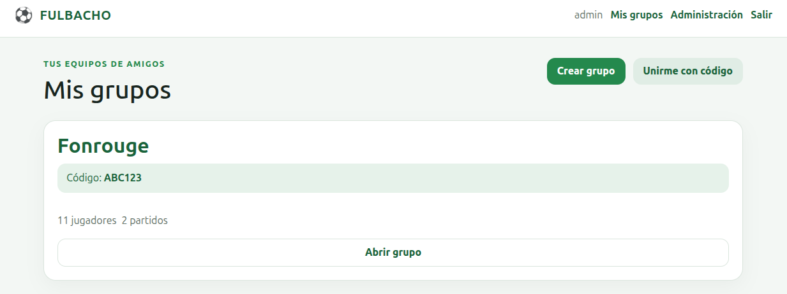
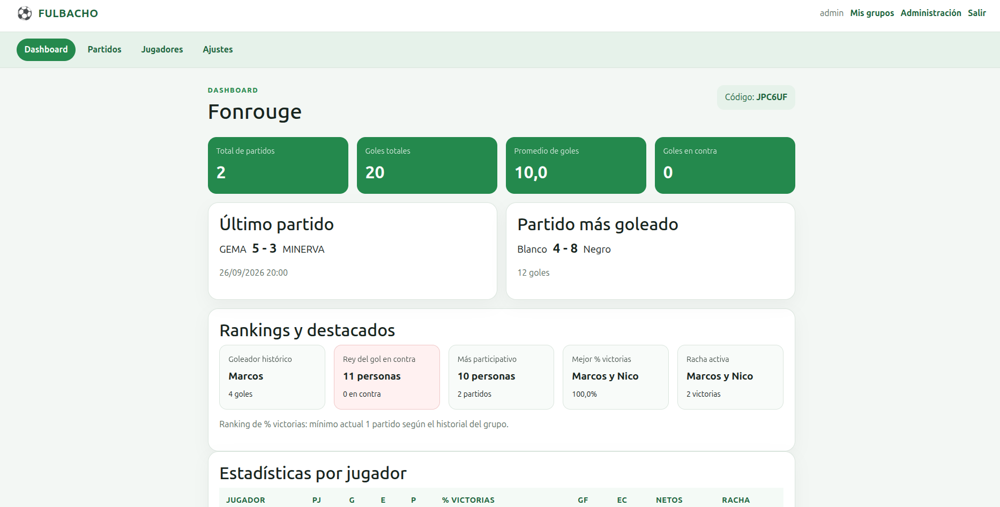
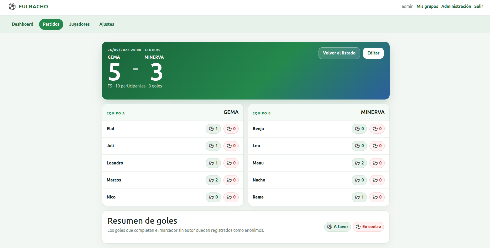

# ⚽ Fulbacho

**Los partidos pasan. Las estadísticas quedan.**

Fulbacho es una aplicación web para registrar partidos de fútbol entre amigos,
gestionar grupos y jugadores y convertir la actividad del grupo en historial,
estadísticas, rankings y destacados.

## ⚽ Qué podés hacer

- Crear grupos o unirte a uno mediante su código.
- Administrar jugadores habituales y agregar casuales sin crearles una cuenta ni
  incorporarlos a la lista permanente.
- Registrar partidos, elegir cuántos jugadores hay por equipo y armar ambos equipos.
- Cargar resultados, goleadores y goles en contra, dejando goles sin autor cuando
  no se conoce quién los hizo.
- Consultar el historial, las estadísticas individuales y los rankings del grupo.
- Ver participación, porcentaje de victorias, goleadores, goles en contra y rachas.
- Recuperar participaciones históricas al convertir un casual en habitual.
- Importar y exportar jugadores y partidos en archivos CSV.
- Compartir la consulta del grupo mediante el modo invitado.

## Cómo funciona

1. Creá una cuenta y un grupo, o unite a uno existente con su código.
2. Agregá los jugadores habituales.
3. Cargá un partido y elegí la cantidad de jugadores por equipo.
4. Armá los dos equipos, incluyendo casuales si hace falta.
5. Registrá el resultado y los goles.
6. Consultá el historial, las estadísticas y los rankings actualizados.

---

## Capturas

Tres pantallas de Fulbacho para ver cómo se organiza la experiencia dentro de la app.

### Mis grupos

Encontrá tus grupos y entrá a cada uno, creá uno nuevo o sumate mediante un código.

  

### Dashboard del grupo

Seguí la historia del grupo con un resumen de actividad, los últimos resultados,
rankings, destacados y estadísticas por jugador.

  

### Vista de un partido

Consultá un partido del historial con sus equipos, resultado, participantes y goles.

  

---

## Grupos

Podés pertenecer a varios grupos. Cada uno tiene sus propios jugadores, partidos,
estadísticas y actividad. Su código de seis caracteres sirve para unirse con una
cuenta o para consultarlo como invitado.

Los miembros pueden registrar jugadores y partidos. Los administradores del grupo
además pueden cambiar su nombre, gestionar los roles y quitar miembros.

## Jugadores habituales y casuales

Un **habitual** pertenece a la lista del grupo y acumula historial y estadísticas.
No necesita tener una cuenta propia; si la tiene, puede vincularse con su jugador.

Un **casual** participa en un partido sin convertirse en jugador permanente. Puede
volver a jugar en otros partidos y luego convertirse en habitual, o vincularse con
uno existente. Para recuperar su historial elegís las participaciones que le
corresponden: no se asocian automáticamente por tener el mismo nombre. Hasta esa
asociación, sus participaciones no se incluyen en los rankings de habituales.

## Partidos

El formato es flexible: F5, F6, F7, F8 y otras cantidades de jugadores por equipo.
Cada equipo debe completar el mínimo elegido y puede incluir participantes extra
para suplentes o rotación. Los empates son válidos.

Podés registrar goles a favor, goles en contra y goles anónimos. Si faltan autores
para completar el resultado, los goles restantes quedan sin autor. Un gol en contra
siempre se asigna a quien lo hizo y suma para el equipo contrario.

Los partidos se pueden editar durante las primeras 24 horas desde que se registran.

## 📊 Estadísticas y rankings

El grupo muestra su actividad y el partido con más goles. Para cada habitual podés
consultar partidos jugados, victorias, empates, derrotas, porcentaje de victorias,
goles a favor, goles en contra, goles netos y rachas de victorias.

Los rankings y destacados permiten ver quién hizo más goles, quién suma más goles
en contra, quién participó más, quién tiene el mejor porcentaje de victorias y
quién mantiene la mayor racha activa.
Un empate o una derrota corta la racha de victorias.

El ranking de porcentaje de victorias exige una participación mínima que crece con
el historial del grupo:

- Hasta 5 partidos registrados: haber jugado al menos 1.
- Entre 6 y 15: haber jugado al menos una cuarta parte, redondeada hacia abajo,
  con un mínimo de 2.
- Desde 16 partidos: haber jugado al menos 5.

Cuando varias personas comparten un destacado, se muestra el nombre si hay un
líder, «Ana y Beto» si hay dos, y «3 personas», «4 personas», etc., si hay más.

## 👀 Modo invitado

Con el código de un grupo podés consultar sus jugadores, partidos, estadísticas y
rankings sin crear una cuenta. Es un acceso de lectura: no permite agregar ni
modificar datos.

## Administración

Existe una administración global para superusuarios, accesible con el mismo inicio
de sesión habitual. Permite gestionar el estado y los permisos globales de las
cuentas y consultar grupos, miembros y partidos.

Este acceso es independiente del rol de administrador de un grupo, cuyos permisos
se aplican únicamente dentro de ese grupo.

## Estado del proyecto

Fulbacho v2 es un proyecto en evolución. Las funciones y la documentación se siguen
ajustando; no se considera una versión definitivamente terminada.

## Tecnología

Fulbacho está construido con Django, FastAPI, PostgreSQL y Docker.

## Documentación técnica

- [Arquitectura y responsabilidades](docs/architecture.md).
- [Desarrollo local, configuración y tests](docs/development.md).
- [Despliegue en Render y verificación](docs/deployment.md).
- [Administración global y primer superusuario](docs/admin.md).
- [Modelo de dominio y reglas de negocio](docs/models.md).
- [Cambios respecto de Fulbacho v1](docs/migration_from_v1.md).
